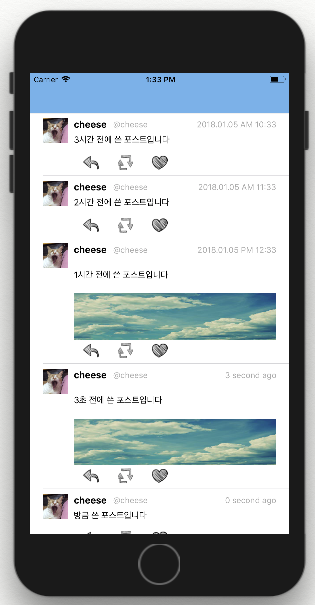

# 📱 Simple Sample Swift Project

## Contents
* iOS Project Sample
* Use UIKIT Components
* Implementation of various view
* Simple Utility Project

## Index
### project 01. Timeline UI

### project 02. limit text edit
### project 03. To Do List
### project 04. Login
### project 05. Loading Bar Animation
### project 06. My Page
### project 07. Local Caching (in tableview)
### project 08. CollectionView
### project 09. Secret Album
### project 10. Widget
### project 11. Notification
### project 12. SplitView
### project 13. Search List
